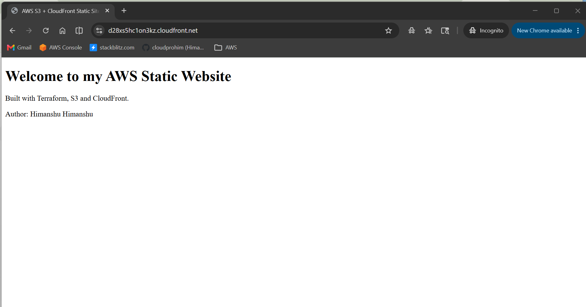
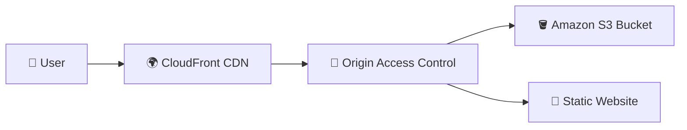
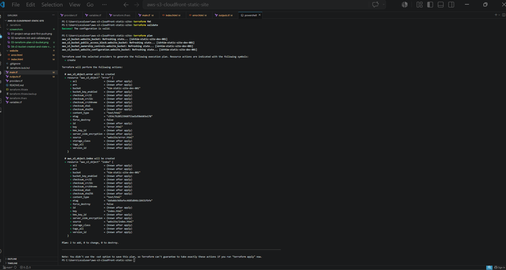
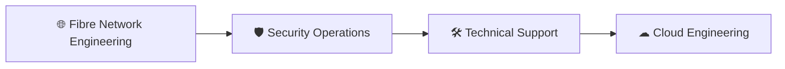

# 🚀 AWS S3 + CloudFront Static Website

Production-style static website deployment on AWS using Terraform, Amazon S3, CloudFront CDN, and Origin Access Control (OAC).

This project demonstrates Infrastructure as Code (IaC), secure content delivery, cloud architecture fundamentals, and AWS best practices through a fully automated Terraform deployment.

---

# 🌐 Live Website

The website is deployed through Amazon CloudFront and delivered globally using AWS edge locations.

**Live Demo:**

https://d28xs5hc1on3kz.cloudfront.net

---

## Live Website (Initial Deployment)



## Enhanced Portfolio Website


---

# 📖 Project Overview

The objective of this project was to design and deploy a secure static website architecture on AWS using Terraform.

The solution leverages:

* Terraform for Infrastructure as Code
* Amazon S3 for static website content storage
* Amazon CloudFront for global content delivery
* Origin Access Control (OAC) for secure S3 access
* IAM Policies for controlled permissions
* GitHub for version control and project documentation

The architecture follows modern AWS security practices by ensuring website content is delivered through CloudFront rather than accessed directly from the S3 bucket.

---

# 🏗 Architecture Diagram



---

# ☁ AWS Services Used

| Service                     | Purpose                               |
| --------------------------- | ------------------------------------- |
| Amazon S3                   | Static website hosting                |
| Amazon CloudFront           | Global content delivery               |
| Origin Access Control (OAC) | Secure CloudFront-to-S3 communication |
| IAM Policy                  | Controlled access permissions         |
| Terraform                   | Infrastructure provisioning           |
| GitHub                      | Version control and documentation     |

---

# 🔨 Deployment Process

### 1. Repository Setup

Created a GitHub repository and initialized the Terraform project structure.

### 2. Infrastructure Configuration

Configured:

* AWS Provider
* Terraform Variables
* Outputs
* Terraform State Management

### 3. Amazon S3 Deployment

Provisioned:

* S3 Bucket
* Ownership Controls
* Public Access Configuration
* Website Configuration

### 4. Website Content Deployment

Uploaded:

* index.html
* error.html

using Terraform-managed S3 objects.

### 5. CloudFront Configuration

Provisioned:

* CloudFront Distribution
* Origin Access Control (OAC)
* HTTPS Redirection
* Secure S3 Access

### 6. Validation & Testing

Verified:

* Terraform State
* S3 Object Uploads
* CloudFront Distribution
* Website Accessibility
* Infrastructure Outputs

---

# 📸 Project Build Evidence

## Project Setup


## Terraform Initialization & Validation


## Terraform Plan - S3 Deployment


## S3 Bucket Creation & State Verification


## Terraform Plan - Website Upload



## Website Files Uploaded


## S3 Object Verification


---

# ⚙ Terraform Commands Used

```bash
terraform init
terraform fmt
terraform validate
terraform plan
terraform apply
terraform state list
```

---

# 🎯 Skills Demonstrated

* Infrastructure as Code (Terraform)
* Amazon S3 Static Website Hosting
* CloudFront CDN Deployment
* Origin Access Control (OAC)
* IAM Policy Configuration
* AWS Security Best Practices
* Git & GitHub Workflow
* Cloud Infrastructure Documentation
* Troubleshooting & Validation
* Cloud Architecture Fundamentals

---

# 📈 Technical Journey



Progressed from fibre network engineering to security operations and technical support, building strong expertise in networking, system integration, troubleshooting, and infrastructure technologies.

Currently focused on cloud engineering, designing scalable AWS solutions using Terraform, automation, serverless technologies, and cloud-native architecture principles.

---

# 🚀 Project Outcomes

✅ Fully automated infrastructure deployment using Terraform

✅ Secure CloudFront-to-S3 architecture using Origin Access Control (OAC)

✅ Global content delivery through Amazon CloudFront

✅ Infrastructure tracked and managed through Terraform State

✅ Version-controlled deployment using GitHub

✅ Production-style AWS static website architecture

✅ Portfolio-ready cloud engineering project

---

# 👨‍💻 Author

## Himanshu Himanshu

Cloud Engineering Graduate | AWS & Terraform Practitioner

Interested in Cloud Support Engineering, Cloud Operations, Site Reliability Engineering (SRE), Infrastructure Engineering, and Cloud Consulting opportunities.

**LinkedIn**
https://www.linkedin.com/in/himanshu-himanshu-1a00a1a4/

**GitHub**
https://github.com/cloudprohim
